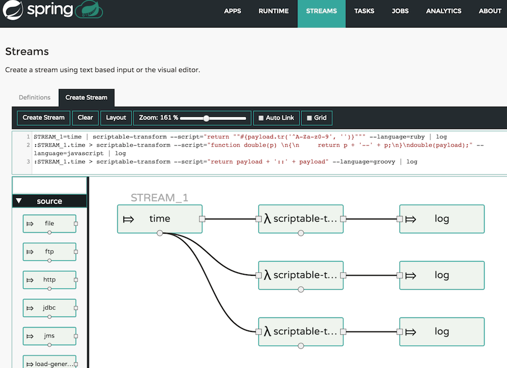

目前微服务的概念已经被广泛接受，然而在提到微服务时，大家首先想到的是 RESTful 服务、hsf 服务等场景，可以使用 SpringBoot 框架快速地开发出一个暴露 hsf 服务的应用，但是对于消息驱动型和任务驱动型的应用, 却还没有一个很好的应对方案。于是 Spring Cloud 社区就专门开发了两个子项目来处理这种类型的应用，分别是Spring-Cloud-Stream(用于开发消息驱动型应用）和 Spring-Cloud-Task（用于开发任务驱动型应用）。而 Spring-Cloud-Dataflow (SCDF) 则是更进一步，提供了对这两种类型应用的编排和部署。

我们先来看一下Spring-Cloud-Stream 类型应用。SCS是专门用来编写消息驱动型微服务的框架,它建立在 SpringBoot 和Spring Integration之上，可以快速开发并能方便地和消息中间件（message broker）通信。例如开发一个从 kafka 接受消息并处理的应用，只需下面几部：

1. 添加依赖
``` xml
<dependency>
    <groupId>org.springframework.cloud</groupId>
    <artifactId>spring-cloud-starter-stream-kafka</artifactId>
</dependency>
```

2. 代码中使用 SCS 的注解，指定处理消息的方法。

```java
@SpringBootApplication // 是一个 springboot 应用，可以自启动
@EnableBinding(Sink.class) // 需要绑定管道，管道会 dui 到相应的消息中间件的 topic 上。
public class StreamdemoApplication {

public static void main(String[] args) {
    SpringApplication.run(StreamdemoApplication.class, args);
}

@SteamListener(Sink.INPUT) // 监听input 管道
public MessageSource<String> timerMessageSource(String payload) {
    //doing business logic with message payload.
}

}
```

3. 在 applicaiton.properties配置文件中指定管道对应的 message broker 的 topic

``` properties
spring.cloud.stream.bindings.input.destination=foo_topic        # input 管道dui 到kafka中的 foo_topic 上
```
只要上面简简单单的三部，一个完全可运行的消息驱动型的微服务模型就搭建完成了。对于 SCS 的更多内容，可以参看官网。

另外一类应用 Spring-Cloud-Task 就更加简单了，它也是建立再 SpringBoot 基础之上，可以定时触发，运行完之后就退出 JVM 的一类应用，具体可以看见官网。


对于以数据为中心的微服务，不可避免地会涉及到数据的来源，去向，数据的加工等问题。
使用 SCS 来开发数据微服务之后，每个 SCS 应用都是一个数据加工的节点，它有一个 input 和 output 分别从消息中间件获取数据并将数据发送回消息中间件。
可以类比一下 unix 的管道命令。现在每个命令就是一个 SCS 的微服务，而中间的管道就是消息中间件。
 

这样一来，对于数据的处理就可以非常灵活强大，就像 unix 管道命令一样，每个 unix 命令（SCS 应用）只做一件小事，但是当通过管道将多个命令连接之后，就可以组成一个强大的程序。

而在文章开头我们就提到，SCDF 就是这样一个微服务的编排系统，他提供了一个方便的 UI，可以允许用户通过 drag-drop 来规划一个数据流，如下图所示：


途中每个节点可以是一个 SCS 应用，也可以是一段简单脚本。 规划完一个数据流（Stream） 之后，只要点击部署，就可以完成流中所有微服务的部署工作。


SCDF中主要涉及到三个概念,分别是 Application、Dataflow Server、 target runtime
* Application: 是一个 springboot 应用jar包，可以是 spring-cloud-stream （常驻运行）或者是 spring-cloud-task（运行之后就退出）
* target runtime: Application 执行的环境，使用目前已经比较成熟的运行时环境，如 Apach YARN，Mesos，Kubernates等。
* Dataflow Server: 负责将 Application 部署到 target runtime 上。 Dataflow Server 提供了一个 Stream DSL 用来方便的组装数据流。同时 Dataflow Server 提供了对数据流一键部署到运行时环境的支持，在部署时可以指定应用使用的内存，cup等资源。
下图描述了 SCDF 中各个部分的关系：


个人认为，相比于传统的数据处理框架如 Storm，spark 等，SCDF 主要有以下一些特点：
1. 编程模型对业务开发人员更加友好，编写 Strom，Spark 等数据处理程序时，普通 java 开发程序员若对大数据技术不太了解，很难编写这类数据处理程序。而使用 SCDF 后，编写数据处理程序无非是写一个SpringBoot 的微服务，简单方便。
2. 将应用的运行时环境代理出去，使用目前市场上已经成熟的运行时环境，而不用像 strom，spark 一样自己管理运行时环境，引入很多运行时复杂性。
3. 数据流中间加入了 message broker，每次数据流动，都要流经一次 message broker，这个设计当然有好有坏，引入消息中间件有助于应用之间的解耦，但是如果stream 节点过多也会导致消息中间件负载过大，同时效率上也不及直接 socket 传输。

目前关于 SCDF 的研究和开发工作，我们组的同学已经成功部署了 DataFlow Server For YARN，使用测试环境的 YARN 集群来部署 SCDF 中的 Stream； 同时我们也实现的binder-metaq，使用集团的 metaq 来作为 SCDF 的 message broker。
下一步我们计划将这个系统搬到线上， 同时我们会梳理目前数据处理任务的一些场景，开发一些常用场景的 Stream。 如监听精卫消息-失效缓存； 监听应用消息-落库到 ODPS 等。这样用户可能连 Application 都不需要编写，只要按照约定发出消息之后，缓存失效或者数据落库就可以自动完成。

SCDF 相对来说还是一个比较新的东西，希望了解或者感兴趣的同学可以联系我们，一起讨论甚至共建这个Data Microservice Framework.


